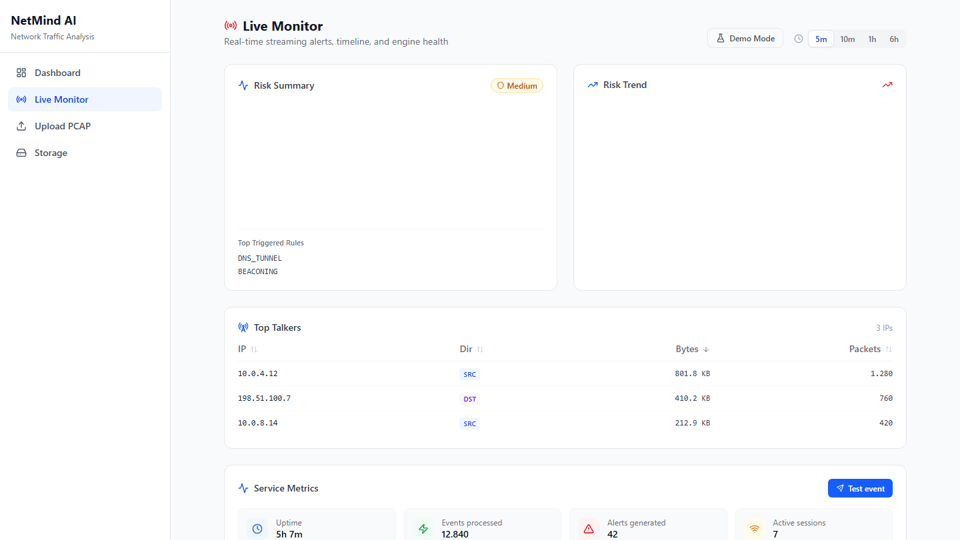
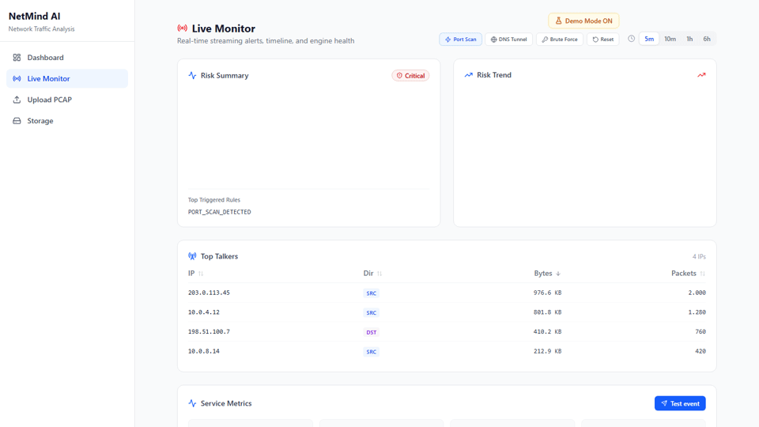
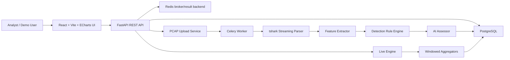

# NetMind AI

**AI-powered network observability and attack simulation platform.**

[](https://github.com/Mustafa-Ali-Ertugrul/NetMind-AI/stargazers)
[](https://github.com/Mustafa-Ali-Ertugrul/NetMind-AI/forks)

NetMind AI turns packet captures and live traffic events into a security cockpit: upload PCAP files, extract protocol and flow features, run detection rules, generate AI-assisted assessments, and demonstrate attack scenarios from a live monitoring dashboard.

It started as a log/PCAP analyzer. It is now closer to a compact cyber range MVP: observability, detection, analyst workflow, and demo-ready attack simulation in one local stack.



---

## Turkce Ozet - Turkiye'deki Isverenler Icin

NetMind AI, siber guvenlik ve yazilim muhendisligi yetkinliklerini tek bir urunde gosteren full-stack bir MVP'dir. Proje PCAP/PCAPNG dosyalarini analiz eder, ag akislarini ve protokol ozetlerini cikarir, Python tabanli tespit kurallarini calistirir, yerel AI destekli degerlendirme uretir ve React tabanli canli izleme panelinde risk, alarm, top talker ve servis sagligi gorunumlerini sunar.

Turkiye'deki isverenler icin one cikan noktalar:

- **Backend gucu:** FastAPI, Celery, Redis, PostgreSQL, SQLAlchemy, Alembic ve Docker Compose ile uretime yaklasan servis mimarisi.
- **Siber guvenlik odagi:** PCAP analizi, flow/feature extraction, rule engine, live alerting, attack simulation ve AI-assisted assessment.
- **Frontend urun deneyimi:** React + Vite arayuzu, canli dashboard, upload akisi, job detaylari, storage durumu ve demo modu.
- **Test ve kalite:** Backend testleri, frontend typecheck/lint/test/e2e akislari ve dataset validation raporlari.
- **Portfolyo degeri:** GitHub Stars/Forks topluluk ilgisi icin takip edilebilir; LinkedIn'de demo GIF veya kisa video ile paylasima uygundur.

---

## Product Snapshot

| Area | Status | What it does |
|---|---:|---|
| PCAP analysis pipeline | Ready | Upload PCAP/PCAPNG, parse packets, extract flows/features, run rules, persist results |
| Async processing | Ready | Celery + Redis pipeline for parse -> extract -> detect -> assess jobs |
| AI assessment | Ready | Local/Ollama-compatible assessor with template fallback |
| Live observability | Ready | Risk score, trend chart, top talkers, live alerts, service metrics, rule statistics |
| Windowed analytics | Ready | 5m/15m/1h style live windows for risk and talker aggregation |
| Demo attack engine | Ready | Port scan, DNS tunnel, brute force, and reset scenarios merged into live UI |
| Frontend UX | Ready | React dashboard, upload flow, job detail view, storage page, live monitor |
| Production hardening | In progress | Dockerized stack exists; auth, TLS, CI/CD, and deployment hardening are next |

---

## Why It Stands Out

Most security tools focus on one lane: packet inspection, IDS alerts, SIEM/XDR dashboards, or lab simulation. NetMind AI combines the parts needed for a portfolio-grade security product demo:

- **PCAP-to-assessment workflow:** analysts can upload captures and get findings plus AI-readable context.
- **Live cockpit:** the dashboard shows current risk, talkers, alert stream, rule stats, and engine health.
- **Attack simulation overlay:** demo scenarios can create a visible incident arc without needing a real attacker or lab traffic generator.
- **Local-first stack:** PostgreSQL, Redis, FastAPI, Celery, React, and Nginx run through Docker Compose.
- **Explainable detection surface:** rules are implemented in Python modules, so behavior can be inspected and extended.

---

## Demo GIFs

### Live Observability Dashboard


### Attack Simulation Flow



The live page includes **Demo Mode** with Port Scan, DNS Tunnel, Brute Force, and Reset scenarios. These scenarios overlay simulated alerts, risk movement, and top talkers on top of real polled data so the product can be demonstrated even without active attack traffic.

---

## LinkedIn Share Text

```text
NetMind AI projemi GitHub'da paylastim:

AI destekli ag gozlemlenebilirligi, PCAP analizi ve saldiri simulasyonu icin full-stack bir siber guvenlik MVP'si.

Kullandigim teknolojiler:
- FastAPI, Celery, Redis, PostgreSQL
- React, Vite, TanStack Query, ECharts
- Docker Compose, tshark, Python rule engine
- Yerel/Ollama uyumlu AI assessment akisi

Projede PCAP/PCAPNG yukleme, flow ve protokol ozeti cikarma, tespit kurallari, canli risk paneli, top talkers, active alerts ve demo attack mode bulunuyor.

GitHub Stars/Forks topluluk ilgisini takip etmek icin:
https://github.com/Mustafa-Ali-Ertugrul/NetMind-AI

#CyberSecurity #Python #FastAPI #React #Docker #SOC #NetworkSecurity #AI
```

---

## 2-Minute Demo Script

Use this flow for a CV, LinkedIn video, GitHub demo GIF, or live presentation.

### 0:00-0:20 - Open with the product

Open `http://localhost` after Docker starts.

Say:

> "NetMind AI is an AI-powered network observability and attack simulation platform. It analyzes packet captures, tracks live network risk, and lets me demonstrate attack scenarios from the dashboard."

Show:

- Sidebar: Dashboard, Live Monitor, Upload PCAP, Storage
- Live Monitor page as the main cockpit
- Risk Summary, Risk Trend, Top Talkers, Active Alerts

### 0:20-0:45 - Show live observability

Go to **Live Monitor**.

Show:

- Window selector for changing the analytics window
- Risk gauge and trend chart
- Top talkers table
- Rule statistics and live service metrics

Say:

> "The system polls live analytics endpoints and keeps a current view of traffic behavior, top talkers, rule activity, and operational health."

### 0:45-1:20 - Trigger the wow moment

Click:

1. **Demo Mode**
2. **Port Scan**

Show:

- Risk level moves upward
- Port scan alerts appear
- A suspicious source IP becomes a top talker
- Active alerts update while the dashboard remains usable

Say:

> "For demos and cyber range scenarios, I can inject controlled attack behavior into the live cockpit. The overlay merges with real data, so this is useful for presentations, training, and UX validation."

### 1:20-1:45 - Show PCAP analysis depth

Go to **Upload PCAP** and explain the offline workflow.

Say:

> "For forensic-style analysis, I can upload PCAP or PCAPNG files. The backend parses packets with tshark, builds flows and protocol summaries, runs detection rules, and stores the job result."

Show, if you have a completed job:

- Job status timeline
- Finding table
- AI report panel
- Top talkers

### 1:45-2:00 - Close with architecture

Say:

> "Under the hood this is a full-stack security MVP: FastAPI, Celery, Redis, PostgreSQL, React, ECharts, and Docker Compose. The next production step is deployment hardening: auth, TLS, CI/CD, and reverse proxy configuration."

End on the Live Monitor screen with Demo Mode active.

---

## Architecture



### Backend

- **FastAPI** exposes health, PCAP, jobs, storage, and live monitoring APIs.
- **Celery + Redis** handles asynchronous PCAP analysis.
- **PostgreSQL** stores PCAP metadata, jobs, alerts, assessments, aggregated flows, protocol summaries, live alerts, and rule stats.
- **Docker volumes** store original PCAP/PCAPNG objects by default; optional MinIO/S3 mode is available for object-storage demos.
- **tshark** powers packet parsing through streaming JSON output.
- **Rule engine** runs the full built-in showcase set: port scan, DNS tunneling, FTP/SMTP abuse, SYN/ICMP flood, HTTP anomaly, top talker, beaconing, cleartext credentials, and large outbound transfer.

### Frontend

- **React + Vite** application shell.
- **TanStack Query** polling for live data and job status.
- **ECharts** risk gauge and trend visualizations.
- **Demo controller** overlays simulated attack scenarios into the live monitor without replacing the real API workflow.

---

## Installation

### Prerequisites

Install these first:

- Docker Desktop or Docker Engine with Compose v2
- Git
- Optional for local development: Node.js 20+, Python 3.11+, PostgreSQL client tools, Redis CLI

The recommended path is Docker Compose because it starts the full product stack.

### 1. Clone the repository

```bash
git clone https://github.com/Mustafa-Ali-Ertugrul/NetMind-AI.git
cd NetMind-AI
```

If you are already inside the project folder, continue from the next step.

### 2. Create your environment file

```bash
cp .env.example .env
```

On Windows PowerShell:

```powershell
Copy-Item .env.example .env
```

Default values are enough for local demo usage:

```env
ENVIRONMENT=development
LOG_LEVEL=INFO
API_PORT=8000
FRONTEND_PORT=80
POSTGRES_DB=netmind
POSTGRES_USER=netmind
POSTGRES_PASSWORD=netmind
POSTGRES_PORT=5432
CORS_ORIGINS=*
UPLOAD_MAX_SIZE_MB=100
OBJECT_STORE_BACKEND=local
S3_ENDPOINT_URL=minio:9000
S3_BUCKET=netmind-pcaps
MINIO_ROOT_USER=netmind
MINIO_ROOT_PASSWORD=netmind-secret
NETMIND_AI_CACHE_ENABLED=true
```

### 3. Start the full stack

```bash
docker compose up --build
```

This starts:

| Service | URL / Port | Purpose |
|---|---|---|
| `frontend` | `http://localhost` | React UI served by Nginx |
| `api` | `http://localhost:8000` | FastAPI backend |
| `db` | `localhost:5432` | PostgreSQL |
| `redis` | `localhost:6379` | Celery broker/result backend |
| `worker` | internal | Async PCAP analysis worker |

Optional MinIO object storage can be started when you want to demonstrate S3-compatible storage instead of the default Docker volume:

```bash
OBJECT_STORE_BACKEND=s3 docker compose --profile object-storage up --build
```

### 4. Verify the API

```bash
curl http://localhost:8000/health
```

Expected response:

```json
{
  "status": "ok",
  "app_name": "NetMind AI",
  "database": "ok",
  "app_version": "0.1.0"
}
```

Open the API docs:

```text
http://localhost:8000/docs
```

Open the app:

```text
http://localhost
```

### 5. Run the demo mode

1. Open `http://localhost/live`.
2. Click **Demo Mode**.
3. Click **Port Scan**, **DNS Tunnel**, or **Brute Force**.
4. Watch risk, top talkers, and active alerts change.
5. Click **Reset** to return to a normal demo state.

### 6. Upload and analyze a PCAP

Use the UI at `http://localhost/upload`, or use curl:

```bash
curl -s -X POST http://localhost:8000/api/v1/pcaps \
  -F "file=@sample.pcapng"
```

The response contains a `job_id`:

```json
{
  "job_id": "uuid...",
  "pcap_id": "uuid...",
  "status": "queued"
}
```

Poll the job:

```bash
JOB_ID=00000000-0000-0000-0000-000000000000
curl -s "http://localhost:8000/api/v1/jobs/${JOB_ID}"
```

Fetch the result after completion:

```bash
curl -s "http://localhost:8000/api/v1/jobs/${JOB_ID}/result"
```

### 7. Stop the stack

```bash
docker compose down
```

To remove local PostgreSQL and PCAP volumes too:

```bash
docker compose down -v
```

---

## Local Development

### Backend

Start PostgreSQL and Redis first, then run the API locally:

```bash
cd backend
python -m venv .venv
```

Linux/macOS:

```bash
source .venv/bin/activate
```

Windows PowerShell:

```powershell
.\.venv\Scripts\Activate.ps1
```

Install dependencies:

```bash
pip install -e .[dev]
```

Start the API:

```bash
uvicorn backend.main:app --reload
```

Start the worker in another terminal:

```bash
celery -A backend.worker worker --loglevel=INFO --pool=prefork --autoscale=10,2
```

For Docker Compose worker scaling, run:

```bash
docker compose up --build --scale worker=3
```

### Frontend

```bash
cd frontend
npm install
npm run dev
```

If the backend is running on a custom URL:

```bash
VITE_API_BASE_URL=http://localhost:8000/api/v1 npm run dev
```

Windows PowerShell:

```powershell
$env:VITE_API_BASE_URL="http://localhost:8000/api/v1"
npm run dev
```

---

## Testing

Backend tests:

```bash
cd backend
python -m pytest tests/ -v
```

Frontend checks:

```bash
cd frontend
npm run typecheck
npm run lint
npm run test
```

Frontend end-to-end tests:

```bash
cd frontend
npm run test:e2e
```

---

## API Quick Reference

| Method | Endpoint | Purpose |
|---|---|---|
| `GET` | `/health` | API, database, and service health |
| `POST` | `/api/v1/pcaps` | Upload PCAP/PCAPNG and create analysis job |
| `GET` | `/api/v1/jobs` | List jobs |
| `GET` | `/api/v1/jobs/{job_id}` | Poll job status |
| `GET` | `/api/v1/jobs/{job_id}/result` | Fetch completed analysis result |
| `GET` | `/api/v1/jobs/{job_id}/artifacts` | Fetch job artifacts |
| `GET` | `/api/v1/live/alerts` | List live alerts |
| `GET` | `/api/v1/live/alerts/timeline` | Live alert timeline buckets |
| `GET` | `/api/v1/live/stats` | Rule statistics |
| `GET` | `/api/v1/live/metrics` | Live engine service metrics |
| `GET` | `/api/v1/live/talkers` | Windowed top talkers |
| `GET` | `/api/v1/live/risk-stream` | Current risk and trend series |
| `POST` | `/api/v1/live/ingest` | Ingest a live debug/demo event |
| `GET` | `/api/v1/storage/status` | Storage health and usage |

---

## Competitor Positioning

NetMind AI is not trying to replace mature security platforms. It is a focused MVP that combines observability, PCAP analysis, AI assessment, and demo simulation in a lightweight local product.

| Tool | Strong at | NetMind AI advantage | NetMind AI limitation |
|---|---|---|---|
| Zeek | Deep network security monitoring and rich protocol logs | Easier product demo path with UI, AI assessment, and attack simulation in one repo | Zeek is far more mature for protocol visibility and production NSM deployments |
| Suricata | High-performance IDS/IPS/NSM detection engine | More approachable full-stack analyst workflow and demo cockpit | Suricata has stronger packet inspection, signatures, IPS mode, and production performance |
| Security Onion | Integrated enterprise-ready monitoring distribution | Smaller, easier to understand, portfolio-friendly architecture | Security Onion is much more complete for SOC operations, case management, and sensor deployment |
| Wazuh | Open-source SIEM/XDR, endpoint/security telemetry, compliance | NetMind is network/PCAP focused with built-in cyber range style demo scenarios | Wazuh has broader endpoint, compliance, alerting, and operational security coverage |
| Wireshark | Manual packet inspection and protocol debugging | NetMind automates pipeline, rule detection, dashboards, and AI summaries | Wireshark remains stronger for low-level packet investigation |

Sources for positioning:

- [Zeek official site](https://zeek.org/)
- [Suricata official site](https://suricata.io/)
- [Security Onion official site](https://securityonion.net/)
- [Wazuh official site](https://wazuh.com/)

---

## Strengths and Tradeoffs

### Strengths

- Full-stack product experience instead of a backend-only analyzer.
- Live observability plus offline PCAP analysis.
- Demo-ready attack scenarios for presentations and training.
- Docker Compose setup with PostgreSQL, Redis, API, worker, frontend, and optional MinIO.
- Rule modules are readable and extensible.
- Local AI assessment path avoids depending on a hosted LLM by default.

### Tradeoffs

- No authentication or role-based access control yet.
- No production TLS/reverse proxy hardening yet.
- Not a replacement for mature IDS/IPS engines in high-throughput environments.
- Demo scenarios are presentation overlays, not a traffic generator.
- Real deployment still needs CI/CD, secrets management, monitoring, and backup policy.

---

## Repository Layout

```text
NetMind-AI/
|-- backend/
|   |-- api/                 FastAPI app, routes, schemas, metrics
|   |-- ai_assessor/         Local AI assessor provider and prompts
|   |-- analytics/           Windowed timeline, talker, protocol, risk aggregators
|   |-- contracts/           Shared Pydantic contracts
|   |-- feature_extractor/   Flow builder, profiles, protocol summaries
|   |-- ingestion/           Event stream and flow aggregation
|   |-- live_engine/         Live risk, adaptive thresholds, streaming service
|   |-- protocol_parser/     tshark wrapper and protocol parsers
|   |-- rule_engine/         Detection rule registry and rule modules
|   |-- storage/             SQLAlchemy models, repositories, writers
|   |-- tests/               Backend unit/integration tests
|   |-- validation/          Dataset validation tooling
|-- frontend/
|   |-- src/api/             API client modules
|   |-- src/components/      Layout, upload, result, and live UI components
|   |-- src/demo/            Demo scenario controller
|   |-- src/hooks/           TanStack Query hooks
|   |-- src/pages/           Dashboard, live monitor, upload, job detail, storage
|   |-- e2e/                 Playwright tests
|-- datasets/                Dataset manifests
|-- db/                      Reference schema
|-- docs/assets/             README screenshots and presentation images
|-- reports/                 Validation reports and planning notes
|-- docker-compose.yaml      Full local product stack
|-- .env.example             Environment template
```

---

## Roadmap

### Deployment Sprint

- Production Docker build review
- Nginx/reverse proxy deployment profile
- TLS termination guide
- Hardened environment variables and secret handling
- GitHub Actions CI pipeline

### Showcase Sprint

- Polished GitHub demo GIFs
- Short architecture video
- LinkedIn/CV project summary and Turkish employer-facing summary
- Release notes and tagged demo version

### Enterprise Expansion

- Historical replay mode
- PDF/CSV export reports
- Authentication and multi-user workspaces
- Anomaly explainability layer
- Sensor deployment model

---

## Status

Current state:

- Engineering completeness: **90-92%**
- Product/demo completeness: **100%**
- Production readiness: **~85%**

The project is ready to show as a working MVP. The next highest-impact work is deployment hardening and public presentation polish.
